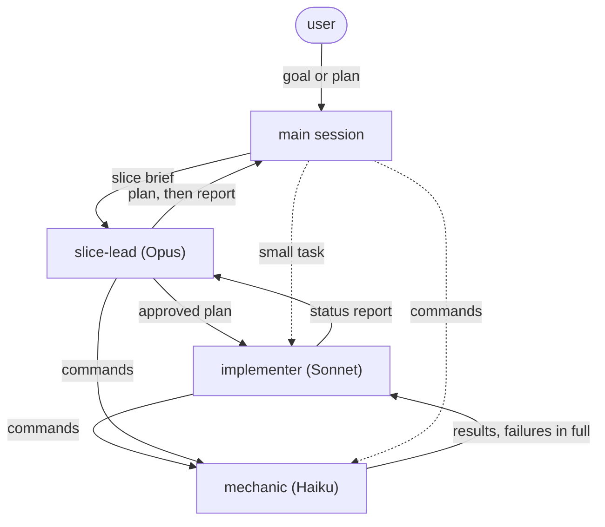

# cascade

Multi-model orchestration hierarchy - the session model orchestrates and signs off, Opus leads vertical slices, Sonnet implements, Haiku runs mechanical tasks.

## How it works

Work flows down the hierarchy; plans, evidence, and escalations flow back up. Dashed edges are direct delegation - the lighter path for work that does not need a full cascade; the Setup section below makes it the default.



`/cascade:orchestrate <goal>` runs in the main session, which owns the goal end to end. It accepts a goal to break down, or a plan that already converged (in conversation or plan mode) - converged plans skip lead authoring; leads validate their pre-approved portion instead:

1. Restate the goal as acceptance criteria, slice it vertically, and size each slice against a complexity rubric - oversized slices are re-cut before any delegation.
2. Delegate each slice to the `slice-lead` agent (Opus), which returns a plan and pauses - or returns NEEDS_RESLICING if the slice turns out bigger than its brief.
3. Review the plan, iterate via feedback to the same lead, approve explicitly.
4. The lead delegates implementation to `implementer` (Sonnet), which federates builds, lints, tests, and shell commands to `mechanic` (Haiku) - successes come back summarized, failures verbatim and in full.
5. The lead reviews the slice diff, routes findings back for fixes, then reports; the orchestrator validates independently and signs off.

Slices run one at a time - the next begins only after sign-off on the current one.

Ambiguity travels up the chain (mechanic -> implementer -> lead -> orchestrator -> user); no tier resolves unclear instructions by guessing.

Outside a full cascade, the main session can delegate to the lower tiers directly: `implementer` for implementation work, `mechanic` for command execution.

## Setup

To make delegation the default rather than opt-in, add to your project's `CLAUDE.md`:

```
Delegate implementation to the cascade `implementer` agent and command execution to the cascade `mechanic` agent - the main session plans, reviews, and decides; it does not write code or run builds and tests itself. Reserve direct shell use for trivial read-only one-liners.

When a plan converges - in plan mode or in conversation - hand execution to `cascade:orchestrate`.
```

The first line makes the cheap tiers the default executors for all work; the second routes every approved plan into the cascade. Omit either to keep that behavior opt-in.

## Components

| Component | Model | Role |
|-----------|-------|------|
| `orchestrate` (skill) | session model | Slices the goal, reviews plans, validates, signs off |
| `slice-lead` (agent) | opus | Plans a slice, delegates implementation, reviews, reports |
| `implementer` (agent) | sonnet | Executes the approved plan |
| `mechanic` (agent) | haiku | Runs commands exactly as asked |

## Prerequisites

- Claude Code with subagent nesting (see the diagram for who spawns whom).

## Installation

```bash
claude plugin install teja-skills/cascade
```

This plugin is Claude-specific - it pins agents to Claude model tiers and relies on Claude Code subagent nesting - so there is no Codex variant.

## License

MIT
