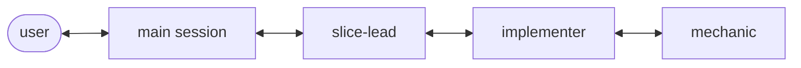

# cascade

Multi-model orchestration hierarchy - the session orchestrates and signs off, a lead plans and delivers each vertical slice, an implementer writes the code, a mechanic runs commands

## How it works

Work flows down the hierarchy; plans, evidence, and escalations flow back up. The main session can also hand small work straight to the implementer, and any tier can call the mechanic directly (the Setup section makes direct delegation the default).


```mermaid
graph LR
    user([user]) <--> session[main session]
    session <--> lead[slice-lead]
    lead <--> impl[implementer]
    impl <--> mech[mechanic]
```

`/cascade:orchestrate <goal>` (`$cascade:orchestrate` on Codex) runs in the main session, which owns the goal end to end. It takes a goal to break down, or a plan that already converged (in conversation or plan mode) - each lead then validates its pre-approved portion instead of authoring a plan:

1. Restate the goal as acceptance criteria, slice it vertically, and size each slice against a complexity rubric - oversized slices are re-cut before any delegation.
2. Delegate each ready slice to its own `slice-lead`, which returns a plan and pauses - or NEEDS_RESLICING if the slice turns out bigger than its brief.
3. Review the plan, iterate via feedback to the same lead, approve explicitly.
4. The lead delegates implementation to the `implementer`, which routes builds, lints, tests, and shell commands through the `mechanic`.
5. The lead reviews the slice diff, routes findings back for fixes, then reports; the orchestrator validates independently and signs off.

A slice starts as soon as the orchestrator has signed off the slices it depends on - a lead reporting done is not sign-off - and runs concurrently with the rest; slices that touch the same files take turns.

Ambiguity travels up the chain; no tier resolves unclear instructions by guessing.

## Setup

To make delegation the default rather than opt-in, add to your project's `CLAUDE.md` or `AGENTS.md`:

```
Delegate implementation to the cascade `implementer` role and command execution to the cascade `mechanic` role - the main session plans, reviews, and decides; it does not write code or run builds and tests itself. Reserve direct shell use for trivial read-only one-liners.

When a plan converges - in plan mode or in conversation - hand execution to the `orchestrate` skill.
```

## Components

| Component | Role |
|-----------|------|
| `orchestrate` (skill) | Slices the goal, reviews plans, validates, signs off |
| `slice-lead` (agent) | Plans a slice, delegates implementation, reviews, reports |
| `implementer` (agent) | Executes the approved plan |
| `mechanic` (agent) | Runs commands exactly as asked |

## Prerequisites

- Subagent nesting three levels deep - session to lead to implementer to mechanic.

## Installation

### Claude Code

```bash
claude plugin install teja-skills/cascade
```

### Codex

Add this entry to your project marketplace at `<your-repo>/.agents/plugins/marketplace.json`:

```json
{
  "name": "cascade",
  "source": {
    "source": "git-subdir",
    "url": "https://github.com/tvishwanadha/skills.git",
    "path": "./plugins/cascade",
    "ref": "main"
  },
  "policy": { "installation": "AVAILABLE", "authentication": "ON_INSTALL" },
  "category": "Developer Tools"
}
```

Then `codex plugin marketplace add .` and `codex plugin add cascade@project-plugins`. See the [marketplace setup recipe](../../README.md#codex) for the full file and its caveats.

Codex plugins cannot contribute subagents - they must be added manually. Copy this repo's role definitions - [`.codex/agents/slice-lead.toml`](../../.codex/agents/slice-lead.toml), [`.codex/agents/implementer.toml`](../../.codex/agents/implementer.toml) and [`.codex/agents/mechanic.toml`](../../.codex/agents/mechanic.toml) - into `.codex/agents/` at your project root, or `~/.codex/agents/` for personal use. Codex discovers role files by directory.

The cascade needs three levels of subagent nesting, and Codex's default multi-agent backend caps nesting at depth 1 - a subagent cannot spawn a subagent - so the cascade cannot run on it. Enabling `multi_agent_v2` removes the depth cap. v2 defaults to 4 concurrent threads and reserves one slot, leaving 3 for subagents, and a cascade fanning out across parallel slices needs more headroom, so set the cap explicitly. Add to `config.toml`:

```toml
[features.multi_agent_v2]
enabled = true
max_concurrent_threads_per_session = 24
```

Everything under a project-local `.codex/` - `config.toml` and `agents/*.toml` alike - is inert until the project is marked trusted; `~/.codex/` is the alternative for personal use.

Set each role's `model` and `model_reasoning_effort` to taste.

## License

MIT
